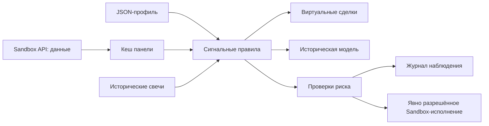

# Архитектура

Панель и CLI используют один набор сигнальных правил из `strategy.py`.
Алгоритм возвращает BUY/SELL/HOLD, но сам не умеет отправлять заявки.
Профиль JSON задаёт инструмент и параметры. Публичные API работают только
с фиксированным Sandbox endpoint, реальный контур не выбирается настройкой.

## Исполнение и восстановление

`auto_trader.py` проверяет свежесть данных, инструмент, класс торгов, бюджет,
размер позиции и дневные ограничения. Состояние защищается файловой блокировкой.
Намерение и идентификатор заявки сохраняются до отправки. Неоднозначная сетевая
ошибка не разрешает слепую повторную отправку: состояние сверяется с брокером.
Deadline ограничивает синхронный запрос. Программный стоп требует работающего
процесса, доступного брокера и свежих цен.

Профили разделяют Sandbox-счета, файл состояния и SQLite-журнал. Старые CLI-
запуски без профиля используют прежнее отдельное состояние. Бумажный портфель
хранится независимо и не вызывает API отправки заявок. При восстановлении
проверяются схема, числа, даты и отпечаток профиля; повреждённое состояние
не сбрасывается молча. После перезапуска бумажная сессия остановлена.

## HTTP-панель

Стандартный `ThreadingHTTPServer`, локальный кеш данных, отдельный поток
обновления и принадлежащий панели дочерний процесс робота. Управляющие запросы
проверяют Host, Origin, локальный ключ сессии и ожидаемый ID профиля. Обновление
профиля очищает кеш: старые данные не используются для нового инструмента.
В Docker SIGTERM запускает штатное завершение, останавливает принадлежащий
процесс и закрывает сервер. Это локальная панель, не публичная торговая платформа.

Состояния профиля: `.runtime/<id>/bot.json`, `bot.paper.json`, `journal.sqlite3`.
Панель использует общую блокировку `.runtime/.dashboard.lock`. В Docker эти
данные вынесены в именованные тома. Текстовые логи вращаются локально; даже
после маскировки токенов они не считаются безопасными для публикации.

## Ограничения исследования

Бэктест и бумажный режим используют общие сигналы, но разные модели исполнения.
Исторический стоп по OHLC не воспроизводит поток котировок и реальную очередь.
Тесты проверяют код, а не наличие рыночного преимущества. Исследовательские
модули не должны сами запускать исполнение и не превращают лучший просмотренный
бэктест в подтверждённую прибыльную стратегию.
